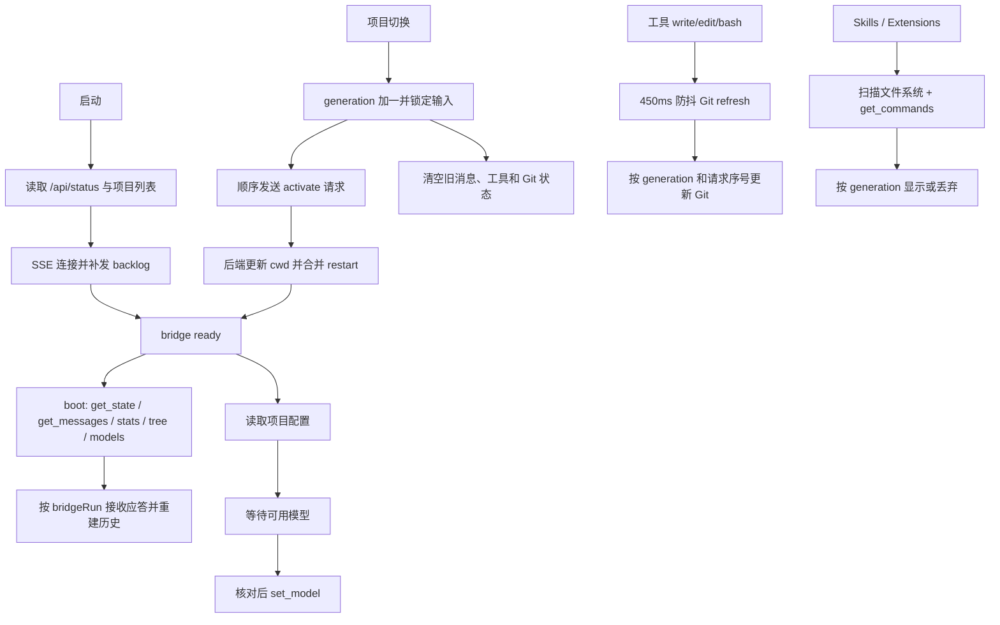

# Pi GUI P4 异步链路与状态审计

## 主要链路

## 生命周期和归属

- `workspaceGeneration` 表示前端最后一次项目选择。旧 HTTP 结果不得更新项目级 UI。
- `bridgeRun` 表示后端每次启动 pi 的运行代次。SSE 中旧 pi 的应答和工具事件不得更新当前会话。
- 项目选择按点击顺序排队；未开始的中间选择跳过，最后一次选择生效。
- 切换时输入和项目操作锁定；新 pi 的 `get_state` 与 `get_messages` 都返回后解锁。同步超时会释放切换状态并给出可执行提示。
- RPC 命令带期望的 `bridgeRun`。后端在写入 pi stdin 前核对，避免旧请求抵达新进程。
- 项目配置保存带期望 cwd。后端在读取请求体后核对，避免旧表单写入新项目。

## 审计发现

| 链路 | 原有风险 | 处理 |
| --- | --- | --- |
| 项目切换 | A 的状态、历史、Git 或 Skills 晚于 B 返回 | generation 与请求序号 |
| 模型恢复 | A 的配置或模型列表在 B ready 后触发 `set_model` | generation、bridgeRun、cwd 三重核对 |
| pi restart | 连续调用重复 kill 或 spawn | 合并正在执行的重启；退出后只安排一个替换进程 |
| pi 启动失败 | ENOENT 可能只有 `error` + `close`，没有 `exit` | `close` 兜底收尾；失败重启指数退避 |
| RPC request | 子进程退出或重启后 pending 等到超时 | 立即 settle 并清理计时器；stdin 异步写错误也 settle |
| SSE | 重连会补发 backlog | `_seq` 去重，并按 bridgeRun 过滤旧 pi 事件 |
| Tool Timeline | pi 崩溃后 running 留在界面 | bridge exit 时收成未完成；历史重建覆盖旧 DOM |
| Git status | 旧请求和新请求乱序 | generation 加单模块请求序号，保留 Git 作为权威 |
| CLI 端口占用 | 任意服务被当成 Pi GUI 打开 | 健康检查核对 app 与 protocol |
| 应用关闭 | `closeAll()` 没显式清除 SSE ping | 逐连接清 timer 后结束流 |

## 真实流程与边界

- `test:reliability-live` 使用隔离的真实 pi 目录，已覆盖 A→B→A、配置保存、连续手动重启、Skill 停用后重启、SSE 断开与 backlog 重连。
- `e2e:app` 使用打包的 Electron 应用，已覆盖消息发送与错误呈现、窗口内 A→B→A、配置触发重启、关闭并重新打开后项目和消息历史恢复；渲染进程没有未处理异常。
- 模型服务商返回 402 余额不足，本轮无法在真实模型上验收 Tool 执行和成功回复。Tool Timeline 运行、断线与历史幂等由 UI 模拟和集成测试验证。
- 配置损坏、目录权限、磁盘写失败等已由定向自动测试覆盖主要响应路径，尚未逐项在真实桌面手工复现。
